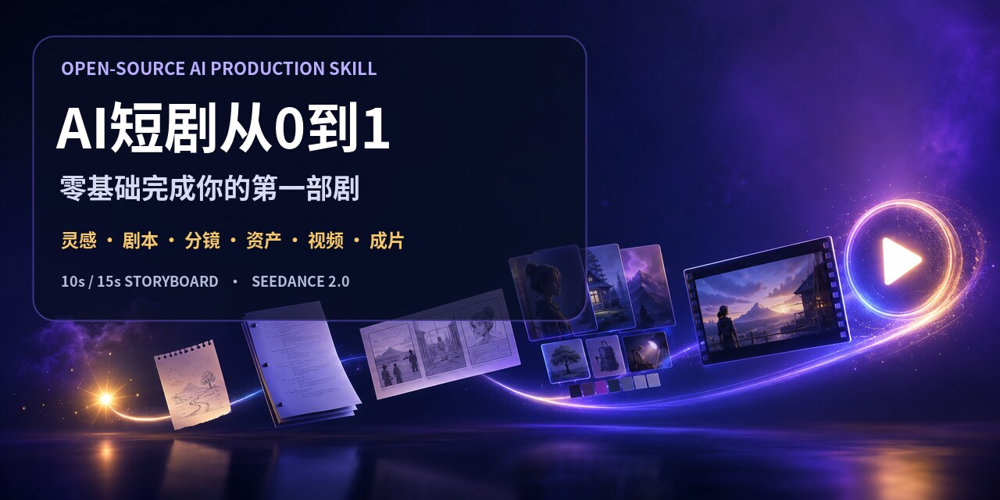
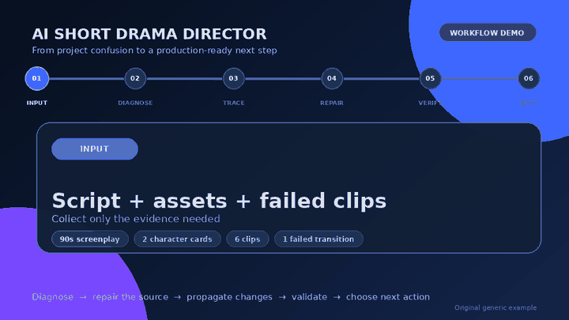
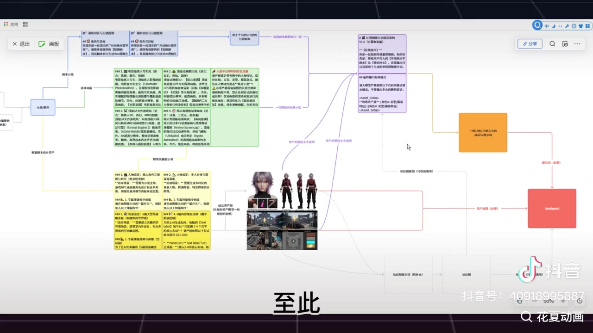
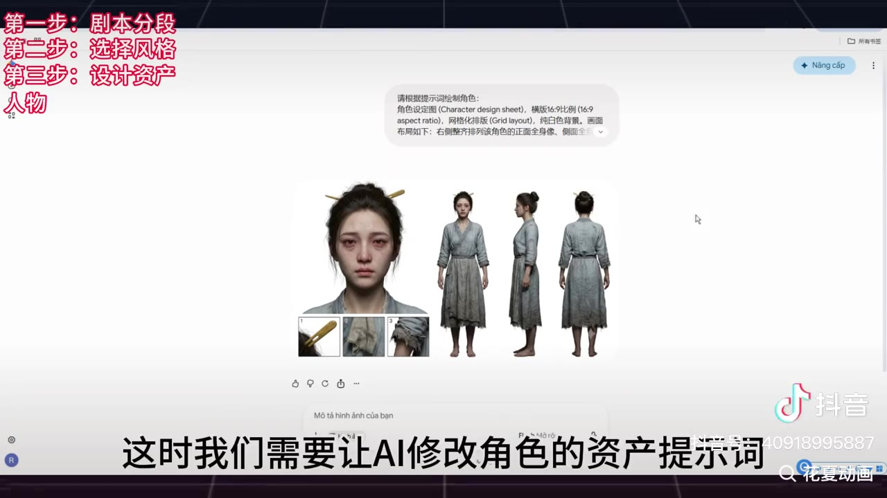
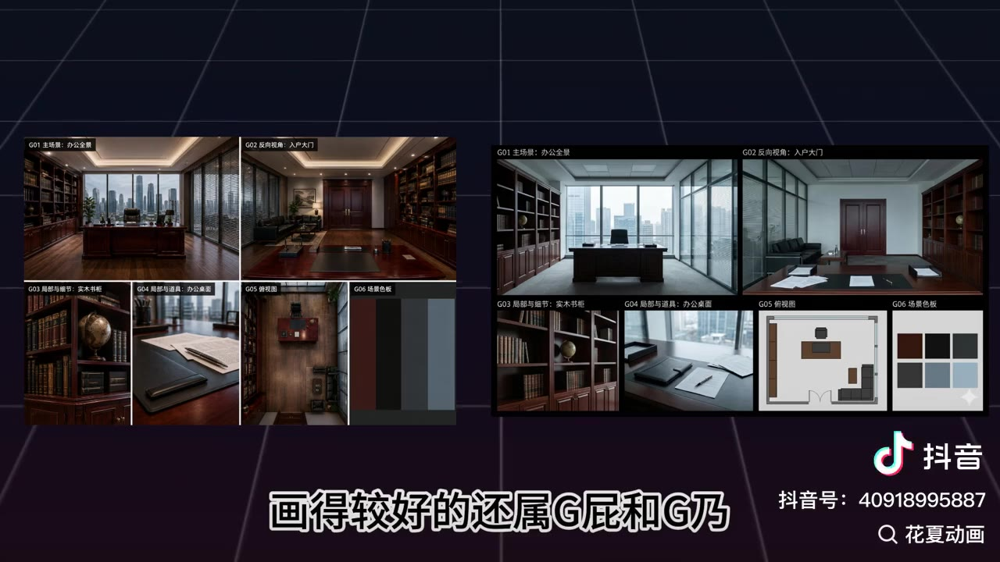
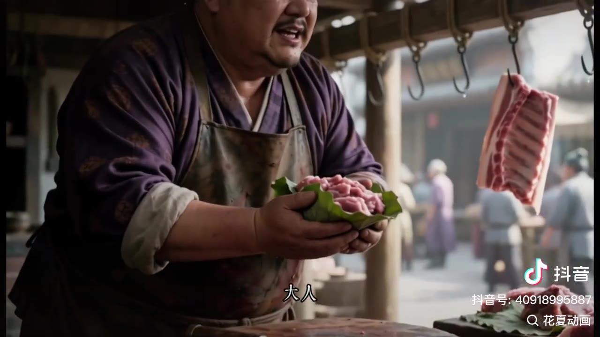
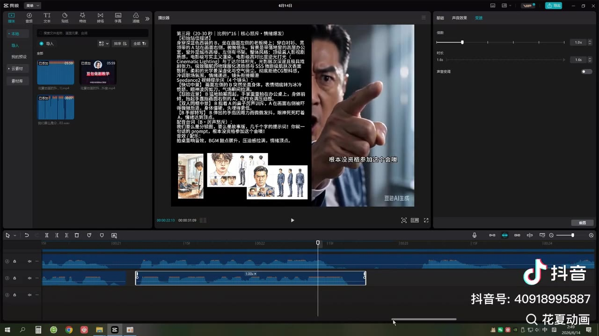
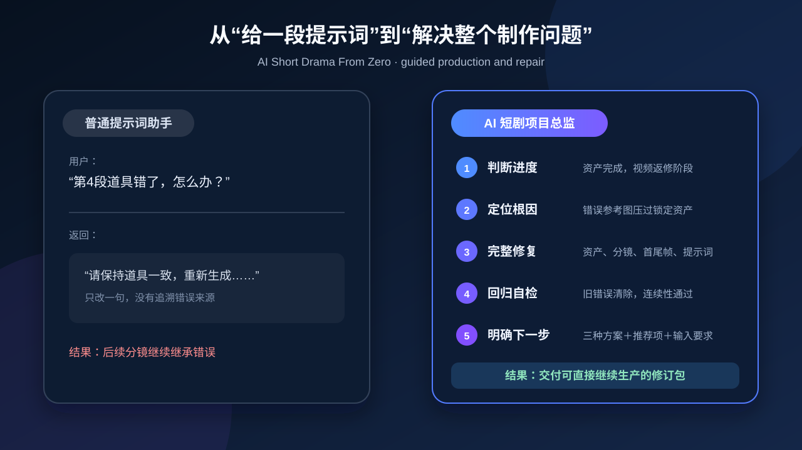
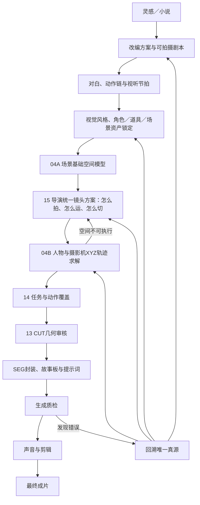

# AI短剧从0到1｜零基础完成你的第一部剧

[**简体中文**](README.md) | [English](README_EN.md)

> 你不需要先学会编剧、分镜、运镜或提示词。这个 Skill 会先判断你已经做到哪里，再一次只带你完成一步：从一句灵感、小说或半成品开始，逐步做到剧本、分镜、资产、图片、Seedance 2.0 视频、声音剪辑和最终成片。






## 你可以从任何进度开始

| 你的现状 | Skill先替你做什么 | 你会立刻得到 |
|---|---|---|
| **A. 只有一个灵感** | 把模糊想法收束成主角、目标、冲突、钩子和结尾方向 | 一句话故事＋可执行的第一版故事骨架 |
| **B. 有小说、故事或剧本** | 判断哪些能直接使用、哪些需要改成可见动作和对白 | 改编方案＋分集结构／可拍摄剧本 |
| **C. 已经做到一半但卡住** | 盘点已完成、未完成、需返工，并追溯真正根因 | 修订后的完整分镜、资产、提示词或自检文档 |

直接回复 `A`、`B`、`C`，或上传你现有的文字、图片、提示词、失败截图和视频。信息足够时，Skill 会自动判断起点，不让你重复填写长问卷。

## 新手模式不是“先上课”，而是边做边学

每轮只推进一个关卡：

1. 告诉你现在只做什么，以及它能避免什么失败；
2. 继承你已经确认的内容，不重复提问；
3. 把专业问题变成固定A/B/C三个普通选择，并给出唯一推荐；
4. 直接替你完成当前阶段的专业产物；
5. 自检后明确告诉你：已完成、未完成、需返工、是否通过；
6. 每次回复末尾固定给A/B/C三个清晰的下一步，你只需回复字母即可继续。

专业验收不会因为用户是新手而降低。Skill 仍会检查读秒、动作完整性、人物和道具一致、空间方向、首尾状态、参考图职责、声音与剪辑，只是不把复杂规则一次性压给用户。

### 一句话启动

```text
使用 $ai-short-drama-director 开启零基础模式。
我只有一个灵感／我有一篇小说／我已经做到一半，
请判断我的起点，一次只带我完成一步，并告诉我已完成和还缺什么。
```

> 仓库名改为 `ai-short-drama-from-zero`；Skill 的调用名继续保留 `$ai-short-drama-director`，避免已有用户和项目失效。

## 固定输出合同

每次回复都使用同一结构，不让新手在长内容里寻找结论：

1. **本轮结果**：先给完成的正文、提示词、修订文件或直接答案；
2. **进度更新**：明确当前阶段、已完成、进行中、未完成和需返工／阻塞；
3. **自检结论**：只根据实际检查标记已通过、进行中、需返工或被阻塞；
4. **下一步请选择**：固定且只能给A、B、C三个行动，恰好一个标记推荐。

制作文档也使用统一外壳：文档信息、进度摘要、完整正文、自检报告、修订记录和待办／阻塞。分镜文档不再使用“字段名一行、内容再一行”的超长清单，而是采用紧凑表格：

| 分镜区块 | 必须包含 |
|---|---|
| 基础信息 | 剧集、SEG编号、10秒／15秒规格、SEG类型、显式SHOT／CUT计数、剧情功能、场景 |
| 资产与连续性 | 人物、服装、道具、站位、上一段继承、起始状态、尾帧、下一段继承 |
| 时间轴执行表 | 时间码、段内镜头、画面动作、表演、台词声音、景别／机位／焦段／运镜 |
| 生成与参考 | 全局风格、参考素材的唯一职责、故事板／图片／视频提示词 |
| 本段自检 | 时长、原子动作、对白容量、资产、空间轴线和首尾状态 |

对话用的A/B/C导航永远放在提示词、XML、JSON和模型数据负载之外，避免污染生成输入。

## 教程案例画面

| 从完整流程开始 | 建立角色资产 | 建立场景空间 |
|---|---|---|
|  |  |  |
| **把全流程拆成可执行步骤** | **防止人物变脸与服装漂移** | **先锁定空间，再制作站位和分镜** |
| 组装视频提示词与参考资产 | 查看生成结果 | 修复对白并完成声音剪辑 |
|  |  |  |
| **只发送当前段真正需要的输入** | **生成后按剧情和资产标准质检** | **处理漏字、变声、衔接与节奏** |

这些画面节选自作者开放下载的教学视频，保留原始水印与创作者标识，仅用于说明工作流。详见[素材说明与画面索引](docs/tutorial/README.md)；仓库不重新分发完整教学视频。

## 项目介绍

很多 AI 短剧工具只负责“写一段提示词”。真正制作时，创作者更常遇到的是：

- 不知道项目已经做到哪一步，下一步应该先做什么；
- 小说能看，但改成剧本后缺动作、缺台词或缺钩子；
- 分镜切得太碎、太挤，10秒内根本演不完；
- 人物、服装、道具、场景和声线在不同片段中漂移；
- 站位图左右错误、跳轴、人物突然出现；
- 参考图压过文字，模型持续复现旧错误；
- Seedance 2.0 能提交却不执行，或直接无法生成；
- 成片出现漏台词、变声、重复开头、背景重建和衔接断裂；
- 明明修改了一个道具，旧错误却仍残留在其他分镜和提示词里。

`ai-short-drama-director` 的目标不是多写一份建议，而是先判断项目进度和真正根因，再直接创建或修好可继续生产的完整交付物，并在交付前完成回归检查。对于零基础用户，它会把同一套专业流程改造成“当前只做一件事”的逐步带做模式。

## 30秒看懂它如何工作



当用户只说“第4段道具错了”时，Skill 不会只补一句“保持道具一致”。它会：

1. 判断项目当前处于哪个生产阶段；
2. 查明错误来自资产、分镜、首尾帧、参考图还是视频提示词；
3. 修改错误真源以及全部受影响的下游内容；
4. 检查旧错误是否清除、时长和连续性是否仍然成立；
5. 汇报已完成、未完成和需返工项；
6. 固定给出A/B/C三种可以立即执行的下一步，并标记唯一推荐方案。

查看[通用原创演示案例](docs/demo/README.md)，了解一次“道具漂移＋场景衔接＋漏台词”问题如何被完整诊断和修复。

## 它和普通提示词助手有什么不同

| 普通提示词助手 | AI短剧从0到1导演 |
|---|---|
| 只处理用户最后一句话 | 先识别项目阶段、已有成果和真正卡点 |
| 发现问题后给几条建议 | 直接修改剧本、分镜、资产、提示词或完整文档 |
| 只修当前一句提示词 | 回溯唯一真源并同步修复受影响内容 |
| 生成一次就算完成 | 检查剧情、资产、空间、声音和首尾状态后才通过 |
| 不知道下一步做什么 | 报告已完成、未完成、需返工，并固定给A/B/C三个明确选项 |
| 把所有规则塞进一个长 Prompt | 按当前阶段加载对应模块，控制上下文和参考素材 |

## 核心功能

### 0. 零基础逐步带做

- 自动识别“只有灵感、已有文字、做到一半”三种起点。
- 首次出现专业词时用普通语言解释，不要求用户先学术语。
- 一次只激活一个制作关卡，并交付当前阶段的完整成品。
- 每轮更新新手进度卡，明确已完成、已锁定、未完成和需返工。
- 用户不知道怎么选时给出推荐，并支持直接回复“按推荐方案继续”。

### 1. 项目进度诊断

- 自动判断项目处于灵感、改编、剧本、分镜、资产、故事板、视频、返修还是后期阶段。
- 区分“已完成、进行中、未开始、被阻塞、需返工”。
- 说明当前最影响进度的问题和下一里程碑完成标准。
- 每轮固定且只提供A/B/C三个可以直接回复选择的下一步方案，并标记唯一推荐项。

### 2. 从灵感到完整故事

- 梳理题材、目标观众、核心冲突、独特卖点和结尾体验。
- 设计短片、单集短剧或连续剧体量。
- 强化开场钩子、升级点、反转和结尾悬念。

### 3. 小说改剧本

- 提取主线、必要支线、人物关系、世界规则和不可改变事实。
- 把叙述、心理和旁白转成可见动作、环境变化或可表演对白。
- 输出分集大纲、单集结构和可拍摄剧本。
- 支持忠实整理、完善、改编和原创四种授权模式。

### 4. 对白添加与读秒

- 根据人物年龄、身份、时代、地域和声线区分口吻。
- 只添加有剧情功能的对白，不机械填满空白时间。
- 检查正常语速、情绪停顿、动作占时和对白舒适区。
- 对过长台词执行压缩、延长或跨镜持续，而不是简单加速。

### 5. 10秒／15秒视听切片

- 正式拆完整剧本前，必须让用户选择10秒版或15秒版。
- 用户拿不准时，可先对同一代表片段制作10秒／15秒双版本样例，再由用户确认。
- 同一集或同一批次锁定一种规格，不自行混用。
- 全局通读后再切片，不把整集剧本直接塞给视频模型。
- 保护完整动作，不腰斩开门、跌倒、拿取、推搡等原子动作。
- 场景切换、时间跳跃和重大状态变化自动新开制片段。
- 输出带资产、起始画面、动作、机位、对白、声音和尾帧状态的完整分镜脚本。

### 6. 视觉与资产设计

- 全局画风锁定：真人电影、3D国风、3A游戏CG、二维动画及自定义风格。
- 核心角色三视图、面部特写和身份细节。
- 群演群体、六格场景概念板、可计算的场景布局图、道具资产卡和声线资产。
- 场景布局在摄影机设计前锁定门、窗、床、桌、柱、通道和相对比例，防止后续为了机位临时移动布景。
- 区分常驻资产与临时剧情状态。
- 使用稳定资产编号和版本，支持草稿、候选、锁定和作废状态。

### 7. 场景空间与统一导演镜头方案

- 先锁定场景布局资产，再建立场景尺寸、固定锚点、可通行区、障碍物和人物初始区。
- 导演思维主动决定每个SHOT怎么拍、摄影机怎么走、在哪里停、在哪里CUT，不把选择推给用户。
- 将导演方案求解为人物与摄影机XYZ关键帧、世界朝向、速度、动态安全距离和关系轴结果。
- 空间算不通时返回导演方案重做，不由空间层私自改CUT或镜头目的。
- 固定、运镜和CUT由同一时间序列自然产生，不使用三套独立模式。

### 8. 故事板与图片提示词

- 根据内容密度选择6格、9格、12格或其他格数。
- 明确“故事板格数不等于切镜数”，支持一镜到底式连续关键帧。
- 锁定首帧、尾帧、人物左右、持物手、场景锚点和运动方向。
- 为版式、角色、场景、道具和首尾帧分配唯一参考职责。
- 故事板必须继承已经通过XYZ求解和CUT审核的镜头方案，不能用图片重新发明站位或机位。

### 9. Seedance 2.0 与视频提示词

- 内部导演计划和外部可复制提示词分层。
- 支持 Seedance 2.0、I2V、FLF2V、视频延长、动作和运镜参考。
- 根据目标平台保留或移除时间码、技术编号和内部说明。
- 控制镜头密度、角色资产、光线、动作、对白、声音和尾帧停点。
- 最终提示词保持短、干净、自然语言化，不混入透明代理或自检日志。

### 10. 模型不执行与提示词失败诊断

- 区分无法提交、模型不执行、生成结果错误和对白声音失败。
- 检查人物过多、动作并行、场景过载、引用职责冲突和上下文污染。
- 当错误参考图压过文字时，优先替换参考、使用干净裁图或建立新会话。
- 对合规问题做最小安全改写，不承诺绕过审核或保证通过。

### 11. 生成返修与全局回写

- 记录每次生成使用的提示词版本、参考素材、问题和采用理由。
- 画面漂亮但改变剧情、人物身份、空间或关键道具时不会直接通过。
- 道具、人物、服装、场景、对白和站位错误会回溯到唯一真源。
- 修改后同步更新受影响的分镜、故事板、首尾帧和视频提示词。
- 对完整文档执行旧错误全局搜索，并交付修订自检版。

### 12. 声线修复、剪辑与成片检查

- 为原创或已授权角色建立稳定声线资产。
- 支持“音色锚点＋情绪参考”的逐句换音流程。
- 检查波形、句长、重音、口型、混响、配乐和环境声。
- 处理上下段重复画面、声音桥、运动方向和剪辑把手。
- 谨慎使用降速和光流补帧，并逐帧检查变形。
- 完成整集人物、道具、背景、对白、声音和衔接巡检。

## 完整工作流



每一关只有满足“内容完整、资产一致、时间可实现、空间连续、下一步可直接使用”后，才会标记为已完成。

## 快速开始

### 下载

- [下载 main 分支 ZIP](https://github.com/sanxsnr/ai-short-drama-from-zero/archive/refs/heads/main.zip)
- 或克隆仓库：

```bash
git clone https://github.com/sanxsnr/ai-short-drama-from-zero.git
```

按你使用的 ChatGPT／Codex 客户端所支持的自定义 Skill 导入方式，导入仓库根目录。请保持 `SKILL.md`、`references/`、`scripts/`、`assets/` 和 `agents/` 的相对位置不变。

### 调用

```text
使用 $ai-short-drama-director 分析我的短剧项目进度，
告诉我已经完成、未完成和需要返工的内容，
找出当前真正卡点，并在每次回复结尾固定给我A/B/C三个下一步方案。
```

也可以直接提出具体任务：

```text
使用 $ai-short-drama-director 把这篇小说改成3集竖屏短剧，
补全可表演对白，再拆成10秒制片段并输出完整分镜脚本。
```

```text
使用 $ai-short-drama-director 检查这份分镜文档。
道具在第8段开始变形，请追溯资产真源，
修改全部受影响段落，并交付完整修订自检版。
```

```text
使用 $ai-short-drama-director 检查这个Seedance视频为什么人物站位错误，
修改对应站位、参考图职责和完整视频提示词。
```

## 典型输入与交付物

| 你提供 | Skill可以交付 |
|---|---|
| 一句话灵感 | 故事核心、卖点、人物冲突、短片结构 |
| 小说或故事素材 | 改编方案、分集大纲、单集剧本 |
| 完整剧本 | 10秒／15秒切片、完整分镜和资产清单 |
| 人物背景与画风 | 角色／群演／场景／道具／声线资产 |
| 分镜脚本 | 故事板、生图提示词、首尾帧提示词 |
| 故事板和参考图 | Seedance 2.0／I2V／FLF2V提示词 |
| 失败提示词 | 合规、复杂度、引用和上下文诊断后的完整修订版 |
| 生成图片或视频 | 可见问题、上游根因、返修版本和回归检查 |
| 多段成片 | 声线统一、拼接、声音桥、节奏和最终巡检方案 |
| DOCX／PDF／表格 | 完整修订文件和自检报告 |

## V2.5 新增｜场景摄影覆盖与多机位中景

- 04A除合法摄影区域外，必须建立`camera_station_candidates`摄影点候选库。
- 15拆成15A整场摄影覆盖设计与15B逐SHOT摄影机程序；先规划机位序列、景别曲线和心理距离，再逐镜求解。
- “当前SHOT方案锁”只锁一个SHOT，不再把同一轴线侧误写成整场只能使用同一摄影点。
- CUT后继承人物、道具、动作和轴线状态；摄影点、景别、前景关系和背景透视默认重新设计。
- 新增完整`observation_signature`和`validate_camera_coverage_sequence.py`，允许不同方位连续中景，拦截同一XYZ、高度、前景和背景透视的全线复制。
- CUT审核不再使用固定摄影机角度阈值；摄影机角度只作为诊断信息。

## V2.4 新增｜统一导演镜头方案

- 不再把固定、运镜和CUT作为三套独立模式或上游三选一。
- 导演思维先一次性设计每个SHOT怎么拍、摄影机轨迹、CUT节点、CUT类型和转接机制；13只审核，不在下游重新发明CUT。
- 04分为两阶段：04A建立场景尺寸与锚点；04B把导演方案求解为人物与摄影机XYZ关键帧。
- 空间求解失败时自动返回导演层重做，不把专业选择推给用户。
- 新增`references/15-directorial-camera-plan.md`和`validate_directorial_camera_plan.py`。

## V2.3 新增

- 固定“本轮结果→进度更新→自检结论→下一步请选择”四段式回答合同。
- 每次回复结尾必须且只能提供A/B/C三个选项，恰好一个推荐。
- 新增统一制作文档外壳和可复制模板。
- 分镜段落改用紧凑元数据表、资产连续性表和时间轴执行表。
- 明确区分一次生成的“分镜段落”和段落内部的“段内镜头”。
- 补齐台词声音、起始状态、尾帧、下一段继承和本段自检字段。

## V2.2 新增

- 分镜拆分前增加强制规格选择门。
- 支持 `A：10秒版`、`B：15秒版`、`C：同一片段双版本比较`。
- 项目进度档案会保存用户确认的分镜规格。
- 同一集禁止无理由混用10秒版和15秒版。
- 项目状态验证工具会检查分镜阶段是否已经选择规格。
- 新增1280×640 GitHub社交分享封面。

## V2.1 新增

- 零基础逐步带做模式与三种入口。
- “现在只做一件事”的单关卡教学循环。
- 普通语言术语翻译与可逆默认决策。
- 新手项目进度卡和移动端友好交付。
- 十一个制作关卡的最低通过标准。
- 卡住、素材不全、生成失败时的明确恢复路径。

## V2.0 能力基础

- 可交接的项目状态档案。
- 每次生成的候选版本记录和停止条件。
- 当前阶段最小输入包与上下文预算。
- 参考图压过文字时的排查顺序。
- 旧会话污染后的干净会话重置。
- 原剧本与生产提示词差异闸门。
- 人物、场景和道具任务专用干净裁图。
- 站位图生成后的实际验收。
- 物理接触关系锁定。
- 授权声线双参考和逐句换音流程。
- 重复开头、声音桥、降速和光流补帧规则。
- 项目状态、提示词输入包和跨段连续性验证脚本。

## 验证工具

仓库内提供十二个无第三方依赖的 Python 验证脚本：

```bash
python3 scripts/validate_timeline.py timeline.json
python3 scripts/validate_segment_structure.py segment-structure.json
python3 scripts/validate_project_state.py project-state.json
python3 scripts/validate_prompt_package.py prompt-package.json
python3 scripts/validate_continuity.py continuity.json
python3 scripts/validate_directorial_camera_plan.py directorial-camera-plan.json
python3 scripts/validate_camera_coverage_sequence.py camera-coverage-sequence.json
python3 scripts/validate_spatial_geometry.py spatial-geometry.json
python3 scripts/validate_shot_task.py shot-task.json
python3 scripts/validate_director_cut_intent.py director-cut-intent.json
python3 scripts/validate_cut_geometry.py cut-geometry.json
python3 scripts/validate_rule_sources.py
```

它们分别检查时间码与对白容量、AI直接成片SEG结构、统一导演镜头方案及其人物／摄影机XYZ空间解、整场摄影覆盖重复、项目阶段证据、提示词输入包、跨镜状态继承、人物面向与摄影机可见面、SHOT任务与视角适配、导演提出的CUT类型／转接机制及相邻SHOT视觉差异路径，以及全仓库规则真源一致性。脚本不会取代导演对剧情、表演和美感的判断。

## 目录结构

```text
ai-short-drama-from-zero/
├── SKILL.md
├── README.md
├── README_EN.md
├── ROADMAP.md
├── agents/
│   └── openai.yaml
├── assets/
│   ├── project-state-template.md
│   ├── beginner-progress-card.md
│   ├── production-document-template.md
│   ├── generation-attempt-log.md
│   └── repair-report-template.md
├── references/
│   ├── 00-project-diagnosis.md
│   ├── 01-script-slicing.md
│   ├── 02-visual-style.md
│   ├── 03-asset-design.md
│   ├── 04-blocking-continuity.md
│   ├── 05-video-prompting.md
│   ├── 06-qc-repair-post.md
│   ├── 07-storyboard-image-prompts.md
│   ├── 08-document-revision-delivery.md
│   ├── 09-generation-session-control.md
│   ├── 10-voice-editing-repair.md
│   ├── 11-beginner-guided-mode.md
│   ├── 12-output-format-and-choice-footer.md
│   ├── 13-cut-shot-geometry.md
│   ├── 14-shot-task-action-coverage.md
│   └── 15-directorial-camera-plan.md
├── scripts/
│   ├── validate_timeline.py
│   ├── validate_segment_structure.py
│   ├── validate_project_state.py
│   ├── validate_prompt_package.py
│   ├── validate_continuity.py
│   ├── validate_directorial_camera_plan.py
│   ├── validate_camera_coverage_sequence.py
│   ├── validate_spatial_geometry.py
│   ├── validate_shot_task.py
│   ├── validate_director_cut_intent.py
│   ├── validate_cut_geometry.py
│   └── validate_rule_sources.py
├── docs/
│   ├── demo/
│   ├── media/
│   └── tutorial/
└── .github/
    └── ISSUE_TEMPLATE/
```

## 设计原则

- 不把任何个人项目、固定画幅、固定格数、固定声线或固定节奏设为所有用户的默认规则。
- 不把整集剧本直接塞进单段视频生成。
- 不用华丽提示词掩盖剧情、动作和空间逻辑问题。
- 不只诊断问题，用户要求修复时必须交付完整修订产物。
- 不把一次平台经验写成永久成功率或额度规则。
- 不宣称绕过审核，不保证生成结果；通过可验证流程降低返工概率。
- 不使用真人明星、受保护角色或特定在世创作者风格作为最终目标。

## 常见问题

### 它会自动生成图片或视频吗？

默认负责分析、文字、文档、资产设定和可复制提示词。只有用户明确要求生成、当前环境也提供对应工具时，才会实际调用生成工具。

### 它只支持 Seedance 2.0 吗？

不是。Seedance 2.0 是重点适配对象，同时支持通用 I2V、FLF2V、首尾帧、视频延长和其他自然语言视频模型。

### 我已经做到视频阶段，还需要从头开始吗？

不需要。Skill 会定位到最靠后的真实阶段；发现道具、人物或分镜问题时，只回溯受影响的上游层。

### 为什么每次都固定给A/B/C三个下一步选项？

为了让用户明确知道下一步要提供什么、Skill会做什么、最终会得到什么，同时避免选项太少没有余地、太多造成新手选择压力。三个选项中只标记一个推荐项。

### 能保证提示词一定通过或一次生成成功吗？

不能。Skill 会区分合规、模型负载、引用冲突和平台限制，并执行最小修复、候选比较和回归检查，但不会做虚假保证。

## 参与贡献

欢迎提交 Issue 或 Pull Request，尤其欢迎：

- 不包含私人项目设定的通用工作流改进；
- 可复现的分镜、资产、连续性、声音和生成失败案例；
- 更可靠的验证脚本和测试样例；
- 对不同视频模型的通用适配规则。

可直接使用仓库提供的结构化模板：

- [报告提示词或生成失败](https://github.com/sanxsnr/ai-short-drama-from-zero/issues/new?template=generation-failure.yml)
- [报告 Skill 或验证工具错误](https://github.com/sanxsnr/ai-short-drama-from-zero/issues/new?template=bug-report.yml)
- [提出通用功能建议](https://github.com/sanxsnr/ai-short-drama-from-zero/issues/new?template=feature-request.yml)

提交前请阅读 [CONTRIBUTING.md](CONTRIBUTING.md)，也可以查看[项目路线图](ROADMAP.md)。

## License

[MIT License](LICENSE)

---

如果这个项目帮助你少走了一次返工流程，欢迎 Star。真实、可复现的问题案例，比“万能神词”更能让这个 Skill 继续变强。
