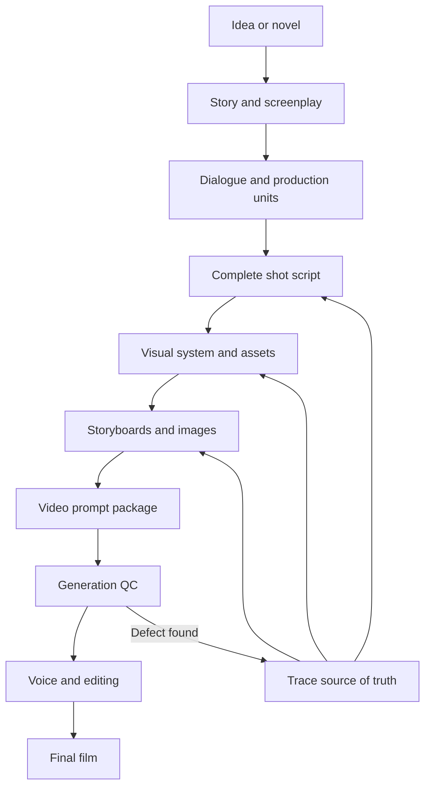

# AI Short Drama Director

[简体中文](README.md) | **English**

> A production-oriented Skill for AI short dramas, animated stories, and cinematic shorts—from an idea or novel to screenplay, shots, reusable assets, Seedance 2.0 prompts, generation repair, editing, and final quality control.


## Why this project exists

Most prompt assistants solve only the last sentence a creator typed. Real AI video production fails elsewhere:

- the creator does not know what stage the project has actually reached;
- a readable novel becomes an unshootable screenplay;
- dialogue, actions, and cuts do not fit the available duration;
- faces, costumes, props, scenes, blocking, or voices drift between clips;
- references conflict and overpower the written instruction;
- a video model rejects the prompt, ignores it, or generates the wrong event;
- a local prop fix is never propagated to later shots and prompt packages;
- clips look good independently but fail when edited together.

`ai-short-drama-director` first diagnoses the project state and the real blocker. It then creates or repairs the production-ready deliverable, checks downstream impact, and reports exactly what is complete, incomplete, blocked, or due for rework.

## What makes it different

| Typical prompt assistant | AI Short Drama Director |
|---|---|
| Responds only to the latest request | Reconstructs the verified production stage and blocker |
| Gives suggestions | Repairs the screenplay, shot plan, asset, prompt, or full document |
| Fixes one sentence | Traces the source of truth and updates every affected deliverable |
| Treats one generation as completion | Checks story, assets, space, audio, and clip continuity |
| Ends with “keep optimizing” | Gives at least three concrete next actions with a recommendation |
| Packs every rule into one giant prompt | Loads only the workflow needed for the current stage |


## Core capabilities

### 1. Project-state diagnosis

- Detects whether the project is at idea, adaptation, screenplay, shot planning, asset, storyboard, video, repair, or post-production stage.
- Separates completed, in progress, not started, blocked, and rework items.
- Identifies the single blocker with the largest downstream impact.
- Defines the next milestone and its acceptance criteria.

### 2. Idea and story development

- Clarifies audience, genre promise, core conflict, hook, escalation, reversal, and ending experience.
- Supports single shorts, episodic vertical dramas, and longer serialized projects.

### 3. Novel-to-screenplay adaptation

- Extracts the main plot, necessary subplots, relationships, world rules, and immutable facts.
- Converts narration and internal thoughts into visible actions, environments, or performable dialogue.
- Produces episode outlines, scene structures, and shootable scripts.

### 4. Dialogue and duration control

- Differentiates voices by age, identity, period, region, and character intent.
- Adds dialogue only when it advances plot, relationship, information, or emotion.
- Checks speaking speed, pauses, action time, and comfortable dialogue density.
- Repairs overloaded dialogue by rewriting, extending, or carrying it across shots.

### 5. 10-second and 15-second production slicing

- Reads the entire episode before segmenting it.
- Protects atomic actions such as opening a door, falling, grabbing an object, or completing physical contact.
- Starts a new unit for scene changes, time jumps, and major state changes.
- Outputs assets, opening state, action, camera, dialogue, sound, and end-state continuity.

### 6. Visual and reusable asset design

- Supports cinematic live action, stylized 3D, game CG, 2D animation, and custom visual systems.
- Creates character, crowd, costume, scene, prop, and voice assets.
- Separates permanent identity from temporary story state.
- Tracks draft, candidate, locked, and obsolete versions.

### 7. Storyboards and image prompts

- Chooses 6, 9, 12, or custom panels from information density instead of habit.
- Treats storyboard panels as continuity keys, not automatically as separate cuts.
- Locks the first frame, last frame, screen direction, held object, hand, scene anchor, and motion path.
- Assigns one responsibility to each layout, character, scene, prop, or transition reference.

### 8. Blocking, screen direction, and physical contact

- Selects the correct forward or reverse scene view.
- Establishes foreground, midground, background, left/right camps, and the 180-degree line.
- Describes start point, path, destination, and fixed obstacles.
- Verifies the generated blocking image before it becomes a production reference.

### 9. Seedance 2.0 and multimodal video prompts

- Separates internal directing logic from the clean prompt sent to the video model.
- Supports Seedance 2.0, I2V, FLF2V, first/last frame, video extension, action reference, and camera reference workflows.
- Adapts prompt structure to the target platform.
- Controls reference priority, action complexity, dialogue, sound, lighting, and the final hold.

### 10. Generation-failure diagnosis

- Distinguishes submission rejection, model noncompliance, wrong visual result, and audio failure.
- Checks cast overload, parallel actions, reference conflicts, prompt complexity, and contaminated context.
- Replaces misleading references, creates clean crops, or resets the generation session when necessary.
- Uses minimal safety rewrites without promising bypasses or guaranteed approval.

### 11. Repair propagation and regression checks

- Logs prompt versions, references, outputs, defects, and selection reasons.
- Rejects attractive outputs that change plot, identity, space, or critical props.
- Traces errors to the source of truth and updates all affected shots, storyboards, frames, and prompts.
- Delivers the complete revised document with a self-check report.

### 12. Voice, editing, and final-film QC

- Creates reusable voice profiles for original or authorized characters.
- Supports timbre anchors, emotion references, and line-by-line replacement.
- Checks intelligibility, timing, emphasis, lip sync, ambience, music, and reverb.
- Repairs repeated openings, broken motion, audio bridges, and edit handles.
- Performs episode-wide character, prop, scene, dialogue, audio, and continuity review.

## Workflow



A stage is complete only when the deliverable is usable downstream, consistent with locked assets, feasible within time, spatially continuous, and checked against the source material.

## Quick start

### Download

- [Download the main branch as ZIP](https://github.com/sanxsnr/ai-short-drama-director/archive/refs/heads/main.zip)
- Or clone:

```bash
git clone https://github.com/sanxsnr/ai-short-drama-director.git
```

Import the repository root using the custom Skill workflow supported by your ChatGPT or Codex client. Keep `SKILL.md`, `references/`, `scripts/`, `assets/`, and `agents/` in their original relative locations.

### Invoke

```text
Use $ai-short-drama-director to diagnose my short-drama project.
Tell me what is verified complete, incomplete, blocked, or due for rework.
Identify the real blocker and give me at least three concrete next actions.
```

```text
Use $ai-short-drama-director to adapt this story into three vertical-drama episodes.
Add performable dialogue, split it into 10-second production units,
and deliver a complete shot script.
```

```text
Use $ai-short-drama-director to inspect this failed Seedance result.
Trace the blocking and prop errors to their source,
then return the complete repaired prompt package and self-check report.
```

## Inputs and deliverables

| You provide | The Skill can deliver |
|---|---|
| A one-line idea | Premise, audience promise, conflict, hook, short-film structure |
| A novel or story | Adaptation plan, episode outline, screenplay |
| A complete script | 10s/15s units, shot script, asset list |
| Character background and visual direction | Character, crowd, costume, scene, prop, and voice assets |
| A shot script | Storyboard prompts, image prompts, first/last frame prompts |
| Storyboards and references | Seedance 2.0, I2V, FLF2V, or extension prompts |
| A rejected or ignored prompt | Compliance, complexity, reference, and context diagnosis plus a full revision |
| Generated images or videos | Visible defects, upstream cause, repaired version, regression check |
| Multiple clips | Voice consistency, stitching, audio bridge, pacing, and final QC plan |
| DOCX, PDF, or tables | Fully revised file and validation report |

## Validation tools

Four dependency-free Python validators are included:

```bash
python3 scripts/validate_timeline.py timeline.json
python3 scripts/validate_project_state.py project-state.json
python3 scripts/validate_prompt_package.py prompt-package.json
python3 scripts/validate_continuity.py continuity.json
```

They validate timing and dialogue capacity, evidence for project-stage claims, prompt-package completeness and reference conflicts, and inherited state between adjacent production units.

## Repository structure

```text
ai-short-drama-director/
├── SKILL.md
├── README.md
├── README_EN.md
├── ROADMAP.md
├── agents/
├── assets/
├── references/
├── scripts/
├── docs/
│   ├── demo/
│   └── media/
└── .github/
    └── ISSUE_TEMPLATE/
```

## Design and safety principles

- No private project, fixed aspect ratio, fixed storyboard grid, personal voice, or individual aesthetic becomes a universal default.
- Do not send an entire episode directly to a single video generation.
- Do not use decorative prompt language to hide story, action, or spatial defects.
- When repair is requested, deliver the repaired artifact instead of stopping at advice.
- Do not present temporary platform behavior as a permanent success rate or limit.
- Do not claim moderation bypasses or guaranteed generation.
- Do not target public figures, protected characters, or a living artist's exact style.

## Demo, roadmap, and contribution

- [General original workflow demo](docs/demo/README.md)
- [Project roadmap](ROADMAP.md)
- [Contribution guide](CONTRIBUTING.md)
- [Report a production or prompt failure](https://github.com/sanxsnr/ai-short-drama-director/issues/new/choose)

Reproducible examples are especially useful: include the production stage, sanitized input, expected result, actual result, reference responsibilities, and the smallest prompt that still reproduces the problem.

## License

[MIT License](LICENSE)

---

If this project saves you one unnecessary regeneration cycle, consider starring it. Reproducible production failures improve the Skill more than any “universal magic prompt.”
