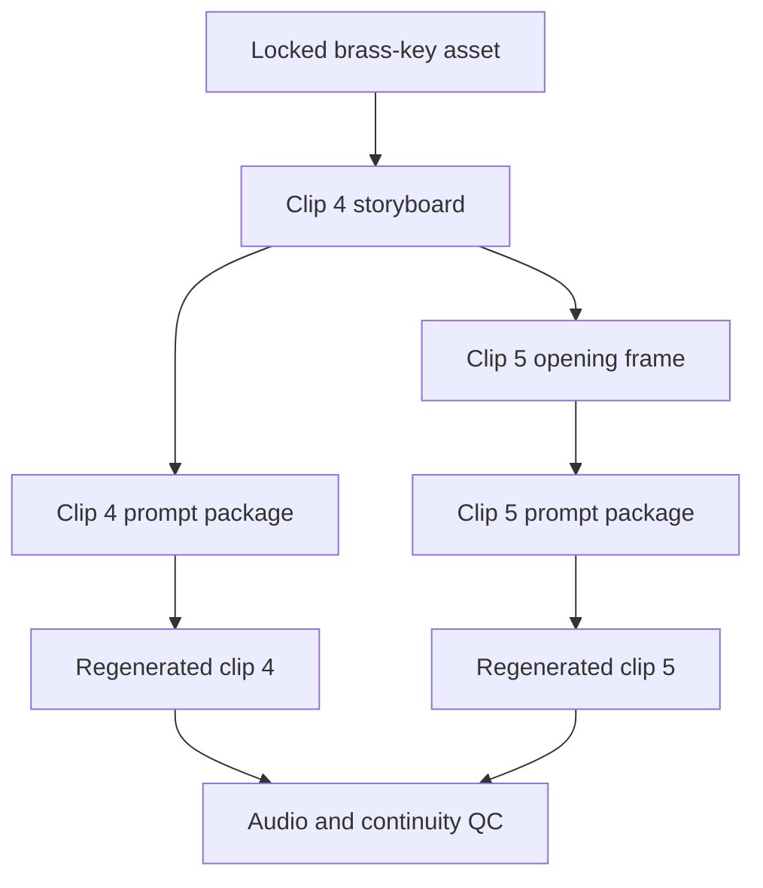

# General Original Workflow Demo

[Back to Chinese README](../../README.md) | [Back to English README](../../README_EN.md)

This example demonstrates the Skill's decision and repair workflow. It is an original, platform-neutral case created for documentation. It does not include a private project, copyrighted character, celebrity likeness, or a claim that every video model will produce identical results.


## Example user input

> I have a 90-second episode script, two locked character cards, one scene reference, a nine-panel storyboard, and six generated clips. In clip 4 the hero's brass key becomes a silver knife; clip 5 starts from a different doorway; one dialogue line is missing. I do not know whether to repair the prompt, regenerate the storyboard, or edit around it.

## 1. Project diagnosis

| Item | Verified state |
|---|---|
| Story and screenplay | Complete |
| Character assets | Complete and locked |
| Prop asset | Complete, but not enforced downstream |
| Scene asset | Complete |
| Storyboard | Needs rework at the clip 4→5 boundary |
| Video generation | Six clips exist; clips 4 and 5 fail continuity |
| Audio | One missing line |
| Final edit | Blocked |

**Real blocker:** the wrong prop and doorway were accepted into the storyboard and then reused as generation references. Editing alone cannot repair the source drift.

## 2. Repair impact map



## 3. Before and after

### Before

```text
Continue the story. The hero walks through the door while holding the prop.
Keep the character consistent and include the dialogue.
```

Problems:

- “the prop” does not identify the locked brass key;
- the doorway and screen direction are not inherited;
- the prompt does not declare which reference controls identity, scene, prop, or transition;
- the missing dialogue has no timing or foreground-audio requirement;
- no final state is defined for the next clip.

### Repaired production instruction

```text
Use the locked character card only for the hero's face, hair, and dark-blue coat.
Use the clean scene plate only for the east doorway and corridor structure.
Use the brass-key crop only for the small aged-brass key held in the hero's right hand.
The opening 0.8 seconds must inherit clip 3's actual final frame: hero on screen left,
body facing right, right hand holding the brass key at waist height.
He crosses the east doorway from left to right and stops beside the corridor lamp.
The key never changes material, shape, hand, or size.
Deliver the original dialogue at normal clear volume with foreground recording;
reduce ambience during the line. End on a stable medium shot that can open clip 5.
```

## 4. Delivered repair package

- Revised clip 4 storyboard section.
- Revised clip 4 video prompt.
- Rebuilt clip 5 opening frame specification.
- Revised clip 5 video prompt.
- Missing-dialogue replacement instruction.
- Continuity self-check covering prop, hand, doorway, direction, dialogue, and end state.
- Generation-attempt log for the rejected and selected candidates.

## 5. Three concrete next actions

1. **Regenerate clips 4 and 5 from the repaired package — Recommended.** Fixes the source error and preserves downstream continuity.
2. **Generate only clean first/last frames before video.** Safer when the video model keeps changing the key or doorway.
3. **Create an edit-only bridge.** Acceptable only if the prop error is never visible and the missing line can be replaced without changing story meaning.

This is the core behavior of the Skill: diagnose the real production state, repair the correct source, propagate the change, validate the result, and leave the creator with explicit next actions.
